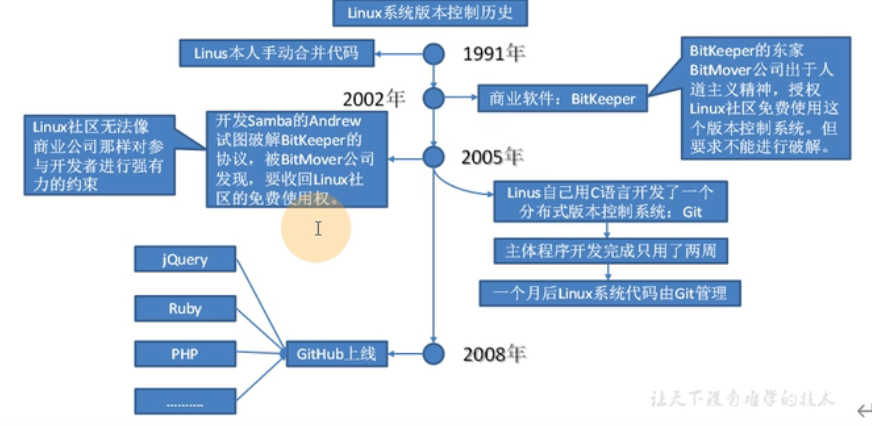
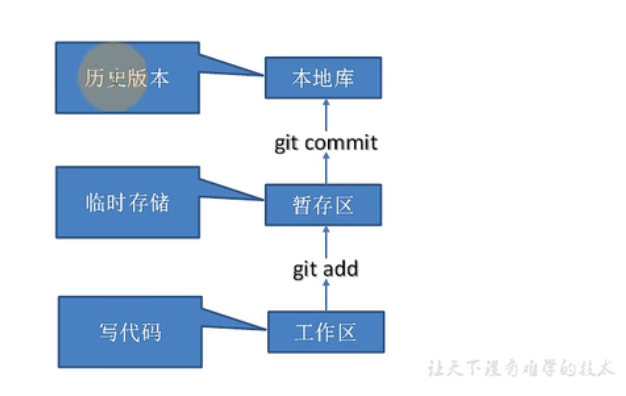
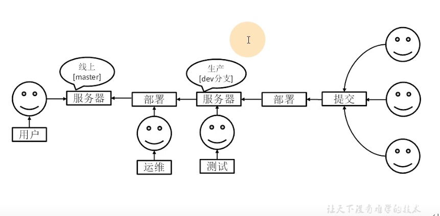
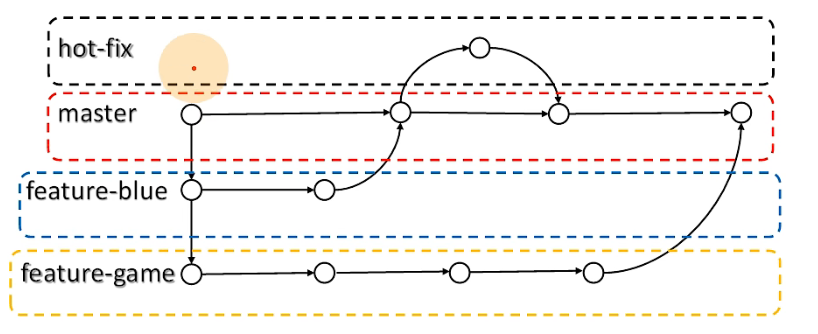
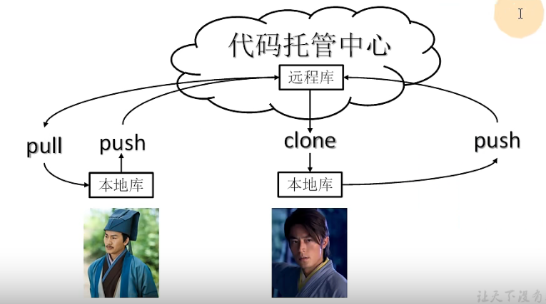
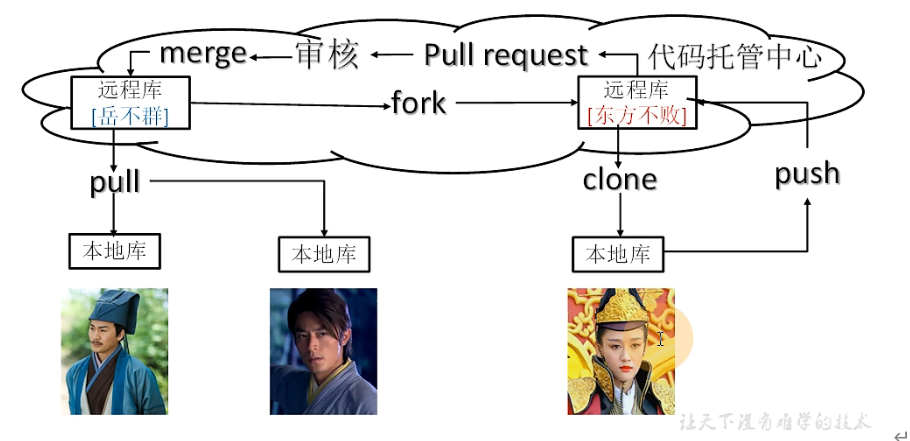

# Git

[TOC]

## Git的概述

git是一个免费的、开源的分布式控制系统，可以快速的处理从小型到大型的各种项目

- 版本控制
  - 版本控制是一种记录文件内容变化，以便将来查阅特定版本修订情况的系统
  - 版本控制其实最重要的是可以记录文件修改历史记录，从而让用户能够查看历史版本，方便版本切换

- 为什么需要版本控制
  - 个人开发过渡到团队协作

- 版本控制工具
  - 集中式版本控制工具：CVS,SVN,VSS...
    > 集中化的版本控制系统都有一个单一的集中管理的服务器，保存所有文件的修订版本，而协同工作的人们都通过客户端连接到这台服务器，取出最新想文件或者提交更新，多年以来，这已经成为版本控制系统的标准做法
    - 缺点：中央服务器的单点故障会导致无法提交更新，无法协同工作
  - 分布式版本控制工具：git，mercurial，bazaar，darcs
    > 想Git这种分布式版本控制工具，客户端提取的不是最新版本的文件快照，而是把代码仓库完整的镜像下来(本地库)。这样任何溢出协同工作用的文件发生故障，时候都可以用其他客户端的本地仓库进行恢复，因为每个客户端的每一次文件提取操作，实际上都是一次对整个问价仓库的完整备份。
    - 分布式的版本控制系统出现以后，解决了集中式版本控制系统的缺陷
      1. 服务器断网的情况下也可以进行开发(因为版本控制是在本地进行的)
      2. 每个客户端保存的也都是整个完整的项目(包含历史记录，更加安全)

- Git的历史

- Git的工作机制

- Git和代码托管中心
  - 代码托管中心是基于网络服务器的远程代码仓库，一般我们简单成为远程库
  - 局域网：Gitlab
  - 互联网：GitHub、Gitee码云

## Git安装

- 官网地址：https://git-scm.com
- 图形化界面TortoiseGit：https://tortoisegit.org

## Git常用命令

|命令|作用|备注|
|---|---|---|
|git config --global user.name 用户名|设置用户签名|cat ~/.gitconfig|
|git config --global user.email 邮箱|设置用户签名|cat ~/.gitconfig|
|git init|初始化本地库||
|git status|查看本地库状态||
|git add file/*|添加到暂存区||
|git rm --cached file|从暂存区移除||
|git commit -m "message" filename|提交本地库||
|git reflog|查看历史版本||
|git log|查看详细历史版本||
|git reset --hard 版本号|版本穿梭||

## Git分支操作

> 在版本控制过程中，同时推进多个任务，为每一个任务，我们就可以创建每个任务的单独分支。使用分支意味着程序员可以把自己的工作从开发主线上分离开来，开发自己分支的时候，不会影响主线分支的运行，分支底层其实也是指针的引用

- 分支的好处
  - 同时并行推进多个功能开发，提高开发效率
  - 各个分支在开发过程中，如果某一个分支开发失败，不会对其他分支有任何影响

- 分支的操作

  |命令名称|作用|
  |---|---|
  |git branch 分支名|创建分支|
  |git branch -v|查看分支|
  |git checkout 分支名|切换分支|
  |git merge 分支名|把指定的分支合并到当前分支上|

- 冲突合并
  - 冲突原因：合并分支时，两个分支在同一个文件的同一个位置上都有修改，需要手动合并修改
  - vim file手动修改
  - 添加暂存区，提交本地库，合并分支

## Git团队协作机制

- 团队内协作

- 跨团队协作

