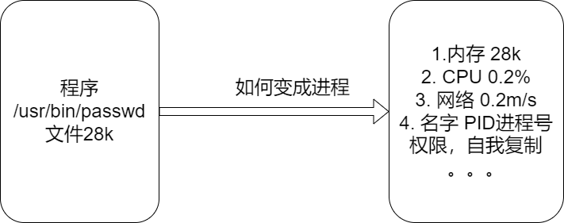
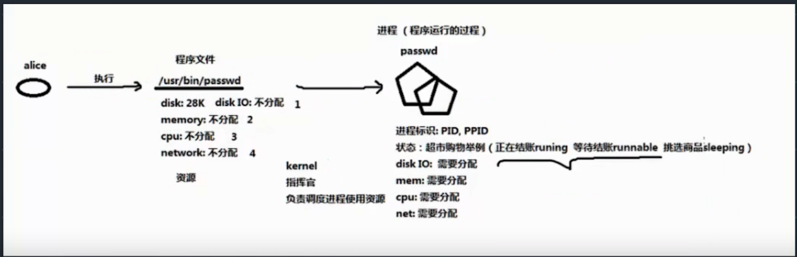
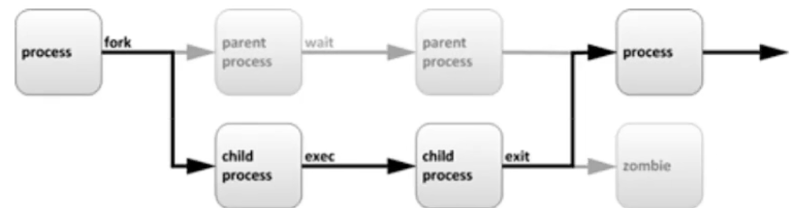
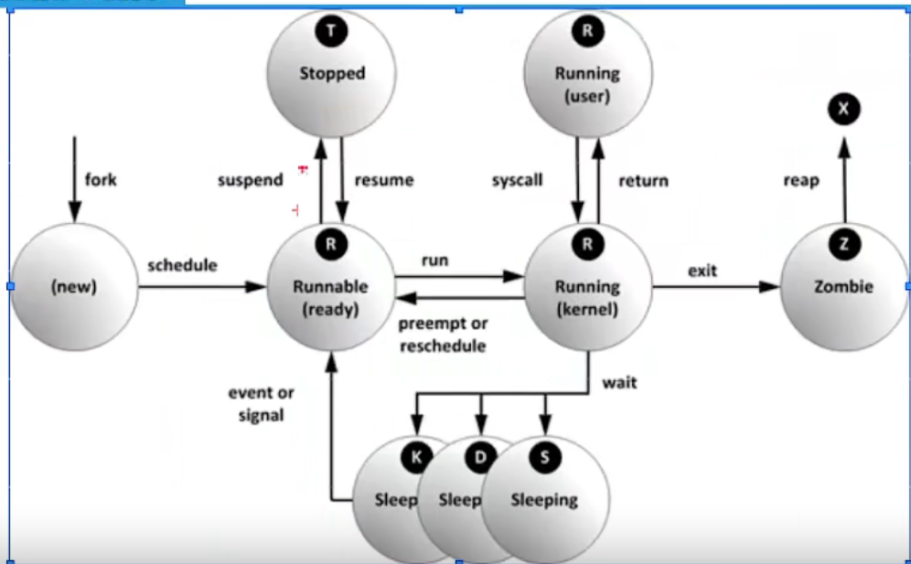

# Linux云计算

[TOC]

## 走进Linux世界

### GNU/Linux的历史

1984年自由软件之父理查德·斯托曼提出开源的概念

林纳斯·本纳第克特·托瓦兹：Linux内核的发明人。1991年创造出了这套当今最流行的操作系统内核之一

### Linux发行版和服务器

- Linux发行版
  - RHEL：Red Hat Enterprise Linux：红帽Linux商业公司
  - CentOS：Community Enterprise Operating System：社区企业操作系统，免费的商业软件
  - Ubuntu（乌班图）：桌面应用为主的开源GNU/Linux操作系统
  - Debian：Debian社区

服务器分为三种：塔式服务器，机架式服务器，刀片服务器(一个刀片就是一个机器)

### 部署centos7服务器系统

centos官方网站：https://www.centos.org；清华镜像站，163镜像站，华为云镜像，阿里云镜像等镜像站

```
语言：简体中文
软件选择：带GUI的服务器-->开发工具、兼容性程序库
磁盘分区：/boot:1G；/swap:2G；/:Other
KDUMP：关闭
root密码：统一为root 
打开网络，开启自动连接
使用远程管理工具XShell或者finalshell
```

## 文件管理

- Linux目录结构简洁
  - windows常用多根的方式组织文件C:\,D:\
  - Linux以单根的方式组织文件/

- Linux目录结构
  - /: 根目录
  - /bin: 存放二进制文件
  - /sbin：管理员的二进制文件
  - /boot：存放启动时使用的文件
  - /dev：存放设备文件
  - /etc：存放配置文件
  - /home：普通用户的家目录
  - /root：管理员用户的家目录
  - /run：运行时的文件，是临时文件
  - /tmp：存放临时文件，可以理解为回收站
  - /usr：应用程序都放在usr目录中
  - /var：日志等文件可以放这里

- Linux文件类型
	- d：目录
	- -：普通文件
	- b：块设备文件
	- c：字符设备文件
	- l：链接文件
	- s：套接字文件
	- p：管道文件

*：通配符
{1..5}：1-5
{a..f}：a-f
{dir1,dir2}
. ./：当前目录
.. ../：上一级目录

```
Ctrl+L：清屏
clear：清屏
ls：列出目录
	-l：详细信息，可以简写为ll
	-a：所有文件，包括隐藏文件
	-d：显示目录的权限
pwd：打印当前路径
cd：改变目录
touch：创建文件
mkdir：创建目录
	-p：递归创建
	-v：显示创建过程
cp：复制文件或者目录
	-r：递归询问，通常复制目录的时候使用
mv：移动文件或者目录，也可以做到改名的效果
rename：重命名
rm：删除文件或目录
	-rf：强制删除文件或目录
rmdir：删除目录
cat：查看文件全部内容
less：查看文件内容
more：翻页查看文件
head -3：查看文件头部前三行
tail -3：查看文件尾部尾部3行
grep：过滤关键字
>：覆盖重定向：ls / > test.txt
>>：追加重定向：ls / >> test.txt
gedit：图形文件编辑器
vi/vim：文件编辑器
	vi的四个模式
		插入模式--i,o(新开一行),a,A
		命令模式--esc，末行模式--:
			:w：保存
			:q：退出
			:wq：保存退出
			!：强制执行
			:set nu：显示行号
			:set nonu：取消设置行号
			:set list：显示控制字符
			/string(n N可以循环的)：查找字符,按n进入下一个
			:1,5 s/root/qianfeng/g：1-5行的root全局换成qianfeng
			:w/tmp/aaa.txt：另存为
		可视化模式--v,V,^v
	文本编辑
		yy：复制一行，3yy：复制光标后面三行
		p：粘贴
		dd：删除一行，3dd：删除3行
		x：删某一个字
		u：撤销
	光标定位
		hjkl：上下左右
		0 $：行首行尾
		gg G：页首页尾，3G进入第三行
	vim没有正常关闭，产生的临时文件的解决问题
		vim 1.txt 非正常关闭
		.1.txt.swp //临时文件，D可以直接删除
```

## 用户和组管理 

- 用户和组信息存储的文件
  - 用户基本信息文件`/etc/passwd`
	- `root: x: 0: 0: root: /root: /bin/bash`
	- 用户名: x: uid: gid: 
	- 用户名：登录系统的名字
	- x：密码占位符
	- uid：用户的身份证号码
		- 系统约定：RHEL7
		- 0 特权用户
		- 1-499 系统用户
		- 1000+ 普通用户
	- gid：组号
	- root描述
	- /root：家目录：登录系统时所在的目录
	- /bin/bash：登录shell：命令解释器
  - 用户密码信息文件`/etc/shadow`
    - `root: $6$80xyLMuAeqMS: : 0: 99999: 7: : : `
	- 登录名：是与/etc/passwd文件中的登录名中的登录名相一致的用户账号
	- 口令字段存放的是加密后的用户口令
	  - 星号表示账号被锁定
	  - 双叹号表示这个密码已经过期了
	  - $6$表明用SHA-512加密
	  - $2$使用Blowfish加密的
	  - $1$使用MD5加密
	  - $5$使用SHA-256加密的
	- 最后一次修改时间 1970年1月1日过了多少天
	- 最小时间间隔
	  - 0代表当天可以改密码，5代表过5天才能改密码
	- 最大时间间隔
	  - 密码有效期天数，99999代表永不过期
	- 警告时间(还有几天到期)
	- 不活动时间
	  - 28代表用户不登录系统，超过28天，禁用
	- 失效时间
	  - 30表示到了30天，账号就不能用了
	- 保留
  - 组信息文件`/etc/group`
	- `root: x: 0: `
	- 组名: 组密码: gid: 组成员

- 组的类型：
  - 基本组
	- 随用户而创建，组名同用户名，基本组只有一个
  - 附加组，
  	- 用户加入的其他组，附加组可以有多个

- 提权
  - whoami：查看当前登录的用户
  - su：永久提权
	- `- user`：会切环境变量
	- ` user`：不会切环境变量
  - sudo：临时提权
	- sudo配置文件语法`/etc/sudoers`
	  - `##user MACHINE=COMMANDS` machine:localhost
	  - `##用户登录的主机=(可以变换的身份) 可以执行的命令`
	  - `%wheel ALL=(ALL) ALL`
	  - `useradd xulei -G wheel`

- 用户管理
  ```test
  useradd user1 user2：创建用户
	-u uid：指定uid
	-d dir：指定家目录
	-g：指定用户的基本组
	-G：指定用户的附加组
  id user：查询用户
  userdel -r user1 user2：删除用户
	-r：同时删除家目录
  passwd：修改自己的密码
	username：修改别的用户，需要权限
  usermod：修改用户属性
	-s /sbin/nologin：修改用户的shell不能登录
	-g：修改用户的基本组
	-G：修改用户的附加组
  gpasswd -d user group：把用户从组里面移出
  ```

- 用户组管理
  ```test
  groupadd group1 group2：创建组
	-g gid：指定gid
  groupdel group：删除组
  groupmod：修改组的属性
	-g：修改gid
  ```

## 用户的权限

### 基本权限UGO 

- 设置权限的两个基本元素
  - 权限对象
	- 属主：u
	- 属组：g
	- 其他人：o
	- 所有人：a(u+g+o)
  - 权限类型
	- 读：r=4
	- 写：w=2
	- 执行：x=1

- 查看文件的属性

|-|rwxr--r--.|1|root|root|0|4月 15 15:00|a.txt|
|---|---|---|---|---|---|---|---|
|文件类型|属主 属组 其他人rwx|链接|属主|属组|大小|创建时间|文件名|


```
chmod：更改文件或目录的权限
	语法：chmod 对象(u/g/o/a)赋值符(+/-/=)权限类型(r/w/x) 文件/目录
	数字语法：chmod 777 file
	-R: 递归，一般针对目录进行操作
chown：可以更改属主和属组
	chown 用户名.组名 文件
	chown 用户名 文件
	chown .组名 文件
	-R: 递归，一般针对目录进行操作
chgrp：更改属组
	chgrp 组名 文件
	-R: 递归，一般针对目录进行操作
```

### 基本权限ACL

- ACL：access control list：访问控制列表
  - 限制用户对文件的访问
  - ACL是UGO的补充，或者说是加强版
- ACL和UGO的区别
  - ACL文件权限管理：设置不同用户，不同的基本权限(rwx)。对象数量不同
  - UGO设置基本权限：只能一个用户，一个组和其他人

```
getfacl：查看文件的ACL权限信息
setfacl：设置ACL
	-m：设置权限信息
	-d：将文件上的ACL权限恢复到默认(setfacl -d file)
	-x：删除用户在文件上的权限(setfacl -x u:user file)
	-b：删除文件所有权限信息(setfacl -b file)
	语法：命令 设置 对象:对象名:权限 文件或目录
	语法：setfacl -m u:user:rwx /tmp/file1
watch -n1 'ls -l /tmp/file1.txt'：每隔一秒看命令的结果(实时)
```

### 特殊权限

- 特殊执行权位s：suid/sgid
  - 针对文件/程序时，具备临时提升权限
  - 是针对文件所设置的一个特殊的权限，使调用文件的用户，临时具备属主的能力

- 文件属性chattr
  - i属性不允许删除文件
  - a属性只允许在文件中追加操作
  - c属性文件在磁盘上会自动压缩
  ```
  lsattr file：列出文件属性
  chattr +/-i file：给文件增加或移除i属性
  ```

- 权限掩码umask
  - 概述：新建文件、目录的默认权限会受到umask的影响，umask表示要减掉的权限
  - 系统默认掩码：0022
    - 特别位：suid=4，sgid=2，stick=1
  ```
  umask：查看默认掩码
    0022
	0777-0022=755
	系统创建目录的时候，权限是755
	文件的默认权限是644
		0777-0022-0111=644
		系统为了保护自己，所以在创建的文件上，去掉了所有的执行权限
  umask 0000：修改默认掩码
  ```

## 进程管理

- 进程是已经启动的可执行程序的运行实例，进程有以下组成部分：
  - 一个文件
  - 被配内存的地址空间
  - 有权限限制
  - 程序代码的一个或多个副本(也叫执行线程)
  - 像人一样拥有状态

  
  


### 进程管理

- 进程的生命周期
  
  - 父进程复制自己的地址空间(fork)创建一个新的子进程结构。每个新进程分配一个唯一的PID，满足跟踪安全性之需，任何进程都可以创建子进程
  - 所有进程都是第一个系统进程的后代：
	- Centos5/6系统进程：init
	- Centos7系统进程：systemd
- 进程的状态：
  - run：运行 R
  - stop：停止 T
  - sleep：休眠 S
  - zombie：僵死 Z
  

- 静态查看进程ps
  ```
  ps aux | head -2
	  USER：运行进程的用户
	  PID：进程ID
      %CPU：CPU占用率
	  %MEM：内存占用率
	  VSZ：占用虚拟内存
	  RSS：占用实际内存
	  TTY：进程运行的终端
	  STAT：进程状态 man ps (/STATE)
	  START：进程的启动时间
	  TIME：进程占用CPU的总时间
	  COMMAND：程序的命令/路径
  ```

### 作业管理

### 虚拟文件系统