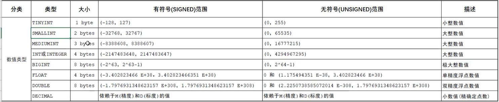
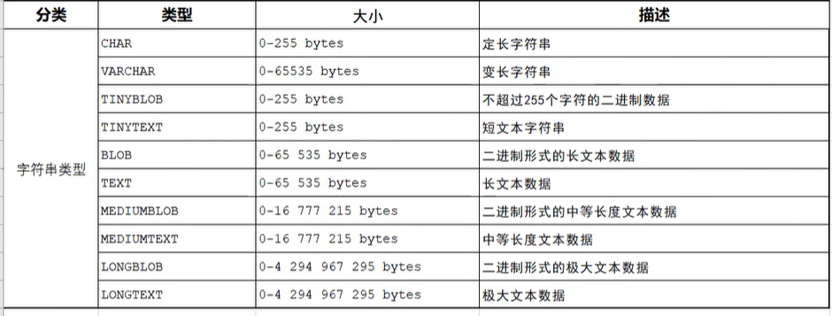
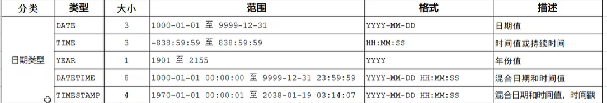
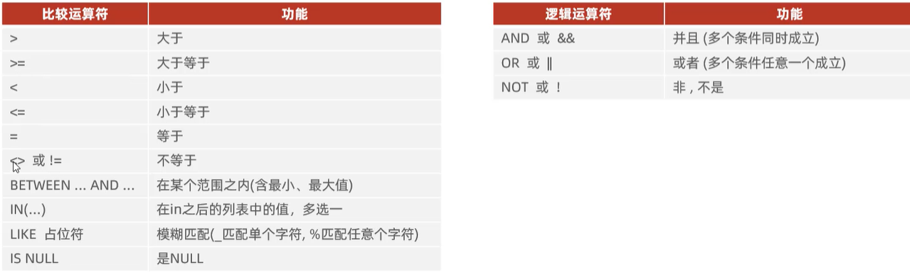
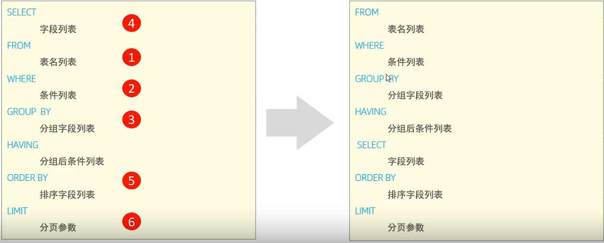
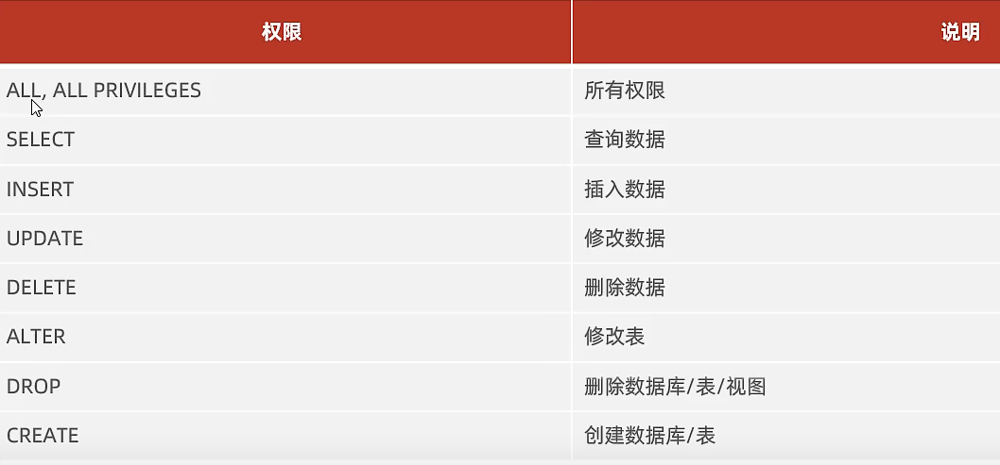

# MySQL

[TOC]

## 基础篇

### MySQL概述

|名称|全称|简称|
|:--:|:--:|:--:|
|数据库|存储数据的仓库，数据有组织的进行存储|DataBase（DB）|
|数据库管理系统|操纵和管理数据库的大型软件|DataBase Management System（DBMS）|
|SQL|操作关系型数据库的编程语言，定义了一套操作关系型数据库统一标准|Structured Query Language（SQL）|

- 主流的关系型数据库管理系统
  - Oracle
  - MySQL
  - SQL Server
  - PostgreSQL
  - MariaDB

- MySQL数据库下载：https://dev.mysql.com/downloads/windows/installer/8.0.html
- mysql数据库的启动与停止
    - 启动：net start mysql80
    - 停止：net stop mysql80
- 客户端连接
    - mysql [-h 127.0.0.1] [-P 3306] -u root -p

- 关系型数据库（RDBMS）
  - 概念：建立在关系模型的基础上，由多张相互连接的二维表组成的数据库
  - 特点：
    - 使用表存储数据，格式统一，便于维护
    - 使用sql语言操作，标准统一，使用方便

### SQL
#### sql通用语法
- SQL语句可以单行或者多行书写，以分号结尾
- SQL语句可以使用空格/缩进来增强语句的可读性
- MySQL数据库的sql语句不区分大小写，关键字建议使用大写
- 注释：
  - 单行注释：`--注释内容` 或 `#注释内容(MySQL独有)`
  - 多行注释：`/*注释内容*/`

#### sql分类

|分类|全称|说明|
|:--:|:--:|:--:|
|DDL|Data Definition Language|数据定义语言，用来定义数据库对象(数据库，表，字段)|
|DML|Data Manipulation language|数据操作语言用来对数据库表中的数据进行增删改|
|DQL|Data Query Language|数据控制语言，用来查询数据库中表的记录|
|DCL|Data control language|数据控制语言，用来创建数据库用户，控制数据库的访问权限|

#### MYSQL数据类型

MySQL中的数据类型有很多，主要分为三类：数字，字符串和日期时间类型

- 数值类型


- 字符串类型


- 日期时间类型


#### DDL

- 数据库操作

  ```sql
  -- 查询所有数据库
  SHOW DATABASES;

  -- 查询当前数据库
  SELECT DATABASE();

  -- 创建
  CREATE DATABASE [IF NOT EXISTS] 数据库名 [DEFAULT CHARSET utf8mb4] [COLLATE 排序规则]

  -- 删除
  DROP DATABASE [IF EXISTS] 数据库名

  -- 使用
  USE 数据库名
  ```

- 表操作

  ```sql
  -- 查询当前数据库所有表
  SHOW TABLES;

  -- 查询表结构
  DESC 表名;

  -- 查询指定表的建表语句
  SHOW CREATE TABLE 表名;

  -- 创建 int date varchar(10)
  CREATE TABLE 表名(
    字段1 类型 [COMMENT 字段1注释],
    字段2 类型 [COMMENT 字段2注释],
    字段3 类型 [COMMENT 字段3注释]
  )[COMMENT 表注释];
  ```

- 修改表

  ```sql
  -- 添加字段
  ALTER TABLE 表名 ADD 字段名 类型(长度) [COMMENT 注释] [约束];

  -- 修改数据类型
  ALTER TABLE 表名 MODIFY 字段名 新数据类型(长度);

  -- 修改字段名和字段类型
  ALTER TABLE 表名 CHANGE 旧字段名 类型(长度) [COMMENT 注释] [约束];

  --删除字段
  ALTER TABLE 表名 DROP 字段名;

  -- 修改表名
  ALTER TABLE 表名 RENAME TO 新表名;

  -- 删除表
  DROP TABLE [IF EXISTS] 表名;

  -- 删除指定表 并重新创建该表
  TRUNCATE TABLE 表名;
  ```

#### DML

- DML英文全称是Data Manipulation Language(数据操作语言)，用来对数据库中标的数据记录进行增删改操作
- 添加数据(INSERT)
  ```sql
  -- 1.给指定字段添加数据
  INSERT INTO 表名 (字段名1, 字段名2,...) VALUES (值1,值2);
  -- 2.给全部字段添加数据
  INSERT INTO 表名 VALUES (值1, 值2);
  -- 3.批量添加数据
  INSERT INTO 表名 (字段1,字段2) VALUES (值1,值2),(值1,值2),(值1,值2);
  INSERT INTO 表名 VALUES (值1,值2),(值1,值2),(值1,值2);
  ```
- 修改数据(UPDATE)
  ```SQL
  -- 基本语法
  UPDATE 表名 SET 字段名1=值1, 字段名2=值2,... [WHERE 条件];
  ```
- 删除数据(DELETE)
  ```sql
  DELECT FROM 表名 [WHERE 条件]
  ```

#### DQL

- DQL英文全称是Data Query Language(数据查询语言)，用来查询数据库中表的记录

- 语法
  ```sql
  SELECT 
    字段列表
  FROM
    表名列表
  WHERE
    条件列表
  GROUP BY
    分组字段列表
  HAVING
    分组后条件列表
  ORDER BY
    排序字段列表
  LIMIT
    分页参数;
  ```

- 基本查询
  ```sql
  -- 查询多个字段
  SELECT 字段,字段,字段 FROM 表名;
  SELECT * FROM 表名; --查询全部字段

  -- 设置别名
  SELECT 字段 AS 别名, 字段 AS 别名 FROM 表名; --AS可以省略
  SELECT 表别名.字段 AS 别名, 表别名.字段 AS 别名 FROM 表名 AS 表别名;

  -- 取出重复记录
  SELECT DISTINCT 字段列表 FROM 表名;
  ```

- 条件查询
  ```sql
  SELECT 字段列表 FROM 表名 WHERE 条件列表;
  ```
  条件：
  

- 聚合函数
  - 将一列数据作为一个整体，进行纵向计算
  - 常见聚合函数
    - count：统计数量
    - max：最大值
    - min：最小值
    - avg：平均值
    - sum：求和
  - 语法：
    ```SQL
    SELECT 聚合函数(字段列表) FROM 表名;
    ```
  - 注意：所有聚合函数是不计算null值的

- 分组查询
  - 语法：
    ```sql
    SELECT 字段列表 FROM 表名 [WHERE 条件] GROUP BY 分组字段名 [HAVING 分组后过滤条件];
    ```
  - WHERE与having区别
    - 执行机制不同，where是分组之前进行过滤，不满足where条件，不参与分组，而having是分组之后对结果进行过滤
    - 判断调经不同，where不能对聚合函数进行判断，而having可以
  - 例子
    ```sql
    -- 根据性别分组, 根据男女员工数量
    SELECT sex,COUNT(*) FROM employee GROUP BY sex;
    -- 根据性别分组，根据男员工和女员工的平均年龄
    SELECT sex,avg(age) FROM employee GROUP BY sex;
    -- 查询年龄小于45的员工，并根据工作地区分组，获取员工数量大于等于3的工作地址
    SELECT workaddress, count(*) FROM employee WHERE age<=45 GROUP BY workaddress HAVING count(*)>=3;
    ```

- 排序查询
  - 语法
    ```sql
    SELECT 字段列表 FROM 表名 ORDER BY 字段1 排序方式1, 字段2 排序方式2;
    ```
  - 排序方式
    - ASC:升序默认值
    - DESC：降序
    - 如果多字段排序，当第一个字段值相同时，才会根据第二个字段进行排序
  - 案例
    ```sql
    -- 根据年龄进行升序排序
    SELECT  * FROM employee ORDER BY age ASC ;
    -- 根据年龄进行降序排序
    SELECT * FROM employee ORDER BY age DESC;
    -- 根据年龄进行升序排，如果年龄相同，按照入职时间降序
    SELECT * FROM employee ORDER BY age ASC, emptime DESC;
    ```

- 分页查询
  - 语法：
    ```sql
    SELECT 字段列表 FROM 表名 LIMIT 起始索引 查询记录数;
    ```
  - 注意：
    - 起始索引是从0开始，起始索引=(查询页码-1)*每页显示记录数
    - 分页查询是数据库的方言，不同的数据库有不同的实现，mysql中是LIMIT
    - 如果查询的是第一页数据，起始索引可以省略，直接可以写`LIMIT 10`
  - 案例
    ```sql
    -- 查询前10条数据
    SELECT * FROM employee LIMIT 0,10;
    -- 查询第二页数据
    SELECT * FROM employee LIMIT 10,10;
    ```

- DQL执行顺序
  

#### DCL

- DCL英文全称是Data Control Language(数据控制语言)，用来管理数据库用户、控制数据库的访问权限

- 管理用户
  ```sql
  -- 查询用户
  USE mysql;
  SELECT * FROM user;

  -- 创建用户 %表示任意主机
  CREATE USER `用户名`@`主机名` IDENTIFIED BY `密码`;

  -- 修改用户密码
  ALTER USER `用户名`@`主机名` IDENTIFIED WITH mysql_native_password BY `新密码`;

  -- 删除用户
  DROP USER `用户名`@`主机名`;
  ```

- 权限控制
  - mysql汇总定义了很多种权限，但是常用的就以下几种
  

```sql
-- 查询权限
SHOW GRANTS FOR '用户名'@'主机名';

-- 授予权限
GRANT 权限列表 ON 数据库名.表名 TO '用户名'@'主机名';

-- 撤销权限
REVOKE 权限列表 ON 数据库名.表名 FROM '用户名'@'主机名';
```

### 函数

### 约束

### 多表查询

### 事务